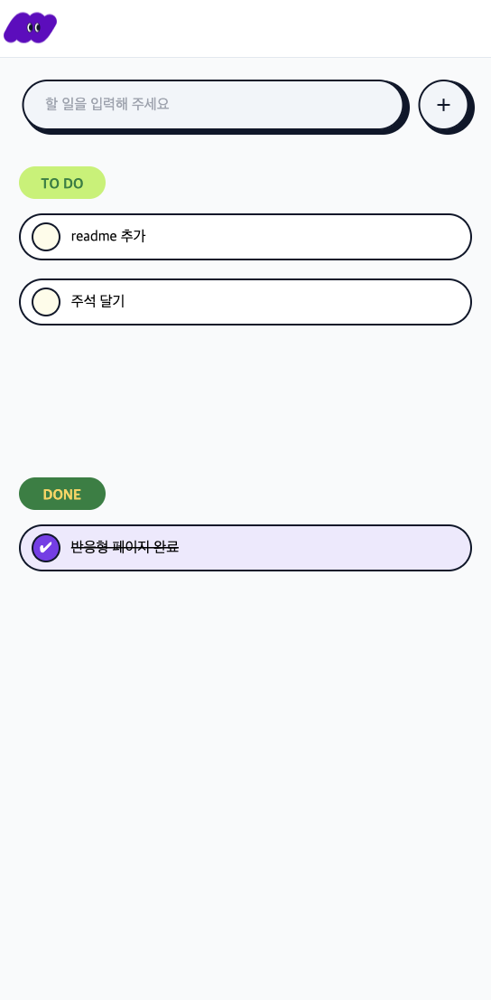

# To do App

### 1. Home

</img>

#### Home 페이지 입니다.

1. 할일 추가

- 상단의 input box를 통해 할일을 추가할 수 있습니다.
- 버튼을 클릭하거나 Enter키를 누르면 됩니다.

2. 상태변경

- 할일 목록의 좌측 원형 버튼 클릭시 상태가 변경됩니다.

3. 디테일 페이지 이동

- 할일 목록을 클릭하시면 디테일 페이지로 이동합니다.

---

### 2. Detail

#### Detail 페이지 입니다.

1. 제목 변경

- 상단 제목 부분을 클릭하고 원하는 값을 입력하면 값이 변경됩니다.
- 설정하신 상태에 따라 다른 색과 아이콘이 표시됩니다.

2. 메모 추가

- 메모(노란색 노트 배경) 부분에 원하시는 메모를 추가할 수 있습니다.
- 글 입력시 버튼 색상이 변경됩니다.

3. 이미지 추가

- 이미지 업로드 시, 미리 볼 수 있습니다.
- 이미지 업로드 시, 버튼 아이콘이 변경됩니다.
